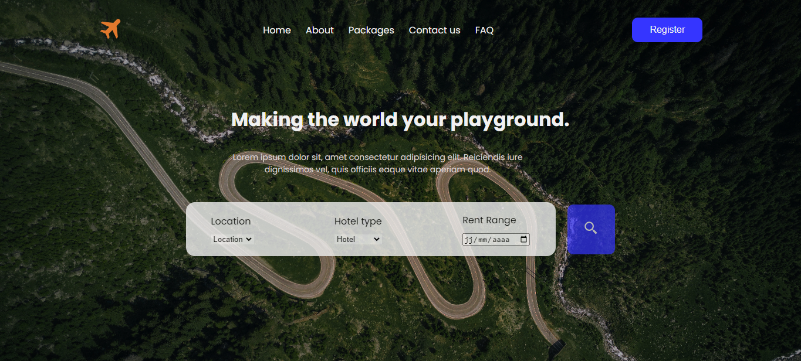
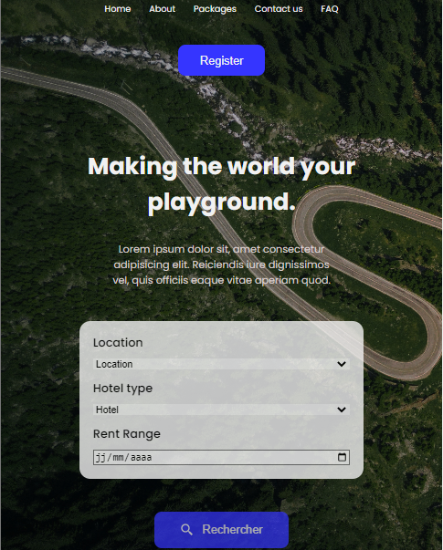

# Travel

Une landing page moderne et responsive en HTML, CSS pour une agence de voyages.  
Vous pouvez la consulter ici: https://marra-travel.netlify.app

  

  

<h1>Desktop</h1>

  

<h1>Mobile</h1>

  

## 🚀 Technologies

- HTML
- CSS

## 🎨 Inspiration

[Dribbble](https://dribbble.com/shots/17407084-Travel-Web-Header-Landing-Page-design/attachments/12533821?mode=media)
